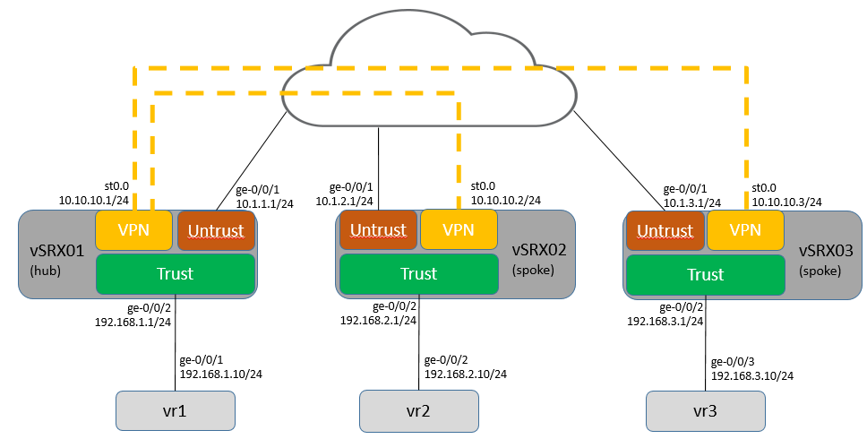

# SRX IPSec Multipoint VPN
An Ansible playbook to generate and/or deploy Juniper SRX configurations necessary to deploy a IPSec Multipoint VPN. This playbook was originally designed to deploy configurations to Vagrant VMs but can be modified to work with non-Vagrant VMs.

# Diagram

# Running Playbook
1. Review/change IKE/IPSec values in group_vars/all/ipsec.yml. See in file instructions.
2. Review/change host specific values for each devices in host_vars/. See in file instructions.
3. a. Build configs: ansible-playbook -i inventory build.yml
3. b. Build configs & deploy: ansible-playbook -i inventory build_deploy.yml
4. Generated configs are in the ./Configs directory

